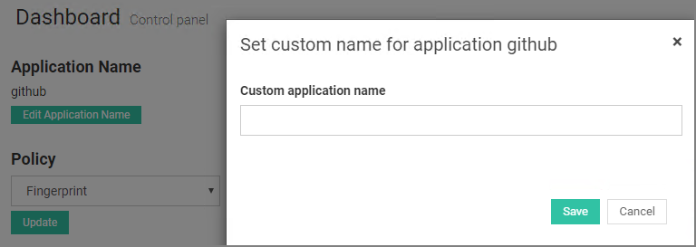
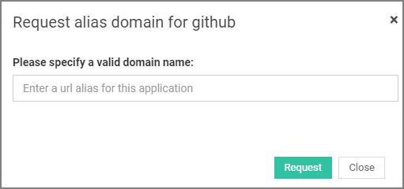

[title]: # (Configure Apps)
[tags]: # (thycotic access control)
[priority]: # (4)
# Configuring an Application 

Requirements: The application must exists on the panel and must be enabled. If not, refer to [Add Application](index.md) or [Enable/Disable Applications](enable-app.md) for more info.

To access an application’s configuration page click on __Configure__ on the app’s tile. From this control panel you have access to core access control options such as Policies, Blocked Elements, Privileged URLs, etc.

## Change Application Name

You can edit or set a custom name for an application by clicking __Edit Application Name__, located at the top left of the main control panel.

## Show Password Reset History

If you wish to track password reset history, click __View history__ in the middle of the page. From the displayed table, you can monitor every user that has been asked for a password reset, when this action occurred and was completed, as well as the current status of the reset process.

## Request Alias URL

If there is a web app that shares the same credentials with the application you are configuring but has a different URL, you can click __Request Alias__ and add this URL.

## Video Recording

### Schedule a Video Recording Session for a Web app

The Thycotic Access Controller provides you with the ability to schedule recordings per web app and per user. This way an admin can record a specific web app for a specified period of time and one or more users.

You can schedule a session by clicking __Schedule recording sessions__ on the right hand side of the main panel and then choose the user and the time period you would like to monitor. Click __Add recording session__ for the session to be scheduled. 

### View Recorded Sessions

Click __View recorded sessions__ on the right hand side of the main panel. A list of every completed session will be displayed sorted by user (Figure 2.8a). 
You can either watch the video for a session (Figure 2.8b) by clicking on the play button located on the right or download it in mpeg-4 format in you machine by clicking the download button next to it. 
Recordings, which are running at the time, can be seen in the “Active Sessions” tab. From there, you can watch the video recording up to that point, while in the background the recording continues. 

